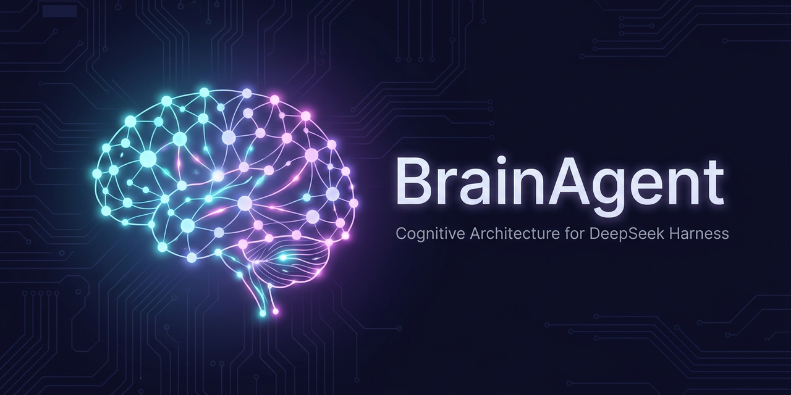

# 🧠 BrainAgent for DeepSeek Harness



[](https://github.com/stas130286-blip/dsh-brainagent/releases) [](https://github.com/topics/dsh-plugin) [](LICENSE)

**Когнитивная архитектура как плагин: память, эмоции, мотивация, обучение и автономия для вашего агента dsh.**

[English version below](#english)

---

## Что это

**BrainAgent** — плагин для [DeepSeek Harness (dsh)](https://github.com/deepseek-ai/deepseek-harness), который превращает штатного агента из исполнителя разовых задач в **долгоживущего персонального ассистента** с внутренней когнитивной системой, смоделированной по принципам работы мозга.

~60 модулей, 6 точек интеграции с платформой, **790 unit-тестов**, всё работает поверх штатных хуков dsh — без единой правки ядра.

## Возможности

### 💾 Память
- **Эпизодическая** — события разговоров с эмоциями и важностью
- **Семантическая** — устойчивые факты с историей ревизий
- **Процедурная** — выученные сценарии действий («как отвечать / как делать»)
- Укрепление при воспроизведении (правило Хебба), затухание нерелевантного
- Хранение локально на диске — **ваши данные не покидают машину**

### 🎭 Эмоции и эмпатия
- Амигдала классифицирует эмоциональную окраску сообщений
- Зеркальные нейроны строят модель собеседника (настроение, стиль, экспертиза)
- Эмоциональная память сохраняет яркие моменты («flashbulb»)

### 📚 Обучение
- Каждый оборот диалога завершается циклом обучения
- Дофаминовая система подкрепляет успешные стратегии
- Базальные ганглии формируют привычки с оценкой успешности

### ⚡ Автономия
- Четыре драйва: социальный, познавательный, творческий, мастерство
- Vital Impulse — агент сам пишет вам, когда есть что сказать (цель, инсайт, желание)
- Goal Stack ведёт долгосрочные цели, Curiosity Drive находит пробелы в знаниях
- DMN «думает в фоне», Autonomous Research сам ищет информацию
- Встроенные предохранители: минимум 10 минут между проактивными сообщениями, разрыватель цикла

### 🌙 Саморегуляция
- Циркадный ритм и Dream Mode — ночью агент «спит» и консолидирует память
- Attention Gate фильтрует контекст по релевантности (экономия токенов)
- Token Economy и таламический гейт пропускают простые сообщения без дорогих LLM-вызовов
- Metabolic Budget следит за расходом ресурсов модулей

### 🪞 Личность
- Agent Identity: автобиографическая память, уроки, профиль способностей
- Qualia Simulator: текущее субъективное состояние
- Temporal Binding: ощущение непрерывности времени

## Установка

### Вариант 1: как пакет dsh (рекомендуется)

Одна команда — плагин скачается прямо с GitHub:

```sh
npx @deepseek-ai/dsh plugin --profile web add github:stas130286-blip/dsh-brainagent
```

Затем запустите Web UI:

```sh
npx @deepseek-ai/dsh web
```

> Пакет содержит готовый собранный модуль (`lib/index.js`) — установка с GitHub не требует ни сборки, ни разрешений на скрипты.

### Вариант 2: из локальной копии (для разработки)

```sh
git clone https://github.com/stas130286-blip/dsh-brainagent.git
npx @deepseek-ai/dsh plugin --profile web add ./dsh-brainagent
npx @deepseek-ai/dsh web
```

Либо подключите исходники оверлеем (запускайте с `--patch`):

```yaml
- insert:
    - id: brainagent
      name: file:///абсолютный/путь/к/dsh-brainagent/src/index.ts
      config: {}
```

## Использование

Поговорите с агентом — BrainAgent включается автоматически. В чате доступны команды:

| Команда | Что делает |
|---|---|
| `/brain status` | Полный отчёт о состоянии всех систем |
| `/brain memory <запрос>` | Поиск по памяти |
| `/brain goals` | Текущие цели |
| `/brain neuro` | Нейромодуляторы (дофамин и др.) |
| `/brain habits` | Выученные привычки |
| `/brain learning` | Циклы обучения и инсайты |
| `/brain circadian` | Циркадный ритм и сон |
| `/brain dream` | Запустить консолидацию памяти |

…и другие: `predict`, `pathways`, `personality`, `metabolic`, `emergent`.

Все модули настраиваются через Config-схему (39 флагов) — любой компонент можно отключить:

```yaml
- id: brainagent
  name: dsh-brainagent
  config:
    autonomousMinGapMs: 1800000   # пауза между проактивными сообщениями (30 мин)
    modules:
      actionDispatcher: false     # например, отключить автономию
```

## Тестирование

```sh
pnpm install        # из корня monorepo dsh
pnpm vitest run     # 50 файлов, 790 тестов
```

Помимо юнит-тестов модулей есть интеграционный eval-харнесс (`src/eval/`):
плагин поднимается целиком на мокнутом dsh-контексте (изолированный
dataDir, честный cleanup эффектов) и прогоняет golden-сценарии —
«живой» диалог через полный конвейер, петлю обучения reward-ledger →
strategy-bandit на реальных событиях шины, автономию (доставка,
гейт инструментов, loop-breaker) и регрессию recall «при таком
состоянии памяти recall возвращает это». Это страховка для будущих
рефакторингов: изменение поведения конвейера видно сразу.
Первая же находка (v0.5.1): фрейминг проактивной доставки не
распознавался как автономный цикл — детекция унифицирована и починена.

## Архитектура

Обработанный дsh `message` проходит конвейер:

```
Thalamus (классификация) → Amygdala (эмоции) → Hippocampus (извлечение памяти)
→ Prefrontal Cortex (решение, fast/slow path) → контекстная инъекция (pre-step)
→ Cerebellum (оценка качества после ответа) → цикл обучения
```

Все модули обмениваются типизированными сигналами через внутренний event bus
(Corpus Callosum), автономные таймеры работают через `ctx.effect`.

Код плагина разбит на слои: `src/index.ts` — только композиция (инициализация
модулей, хуки dsh, cleanup), вся логика — в `src/plugin/` (`config.ts` — схема и
merge конфига, `autonomy.ts` — проактивная доставка и резолвер намерений,
`cycles.ts` — жизненный цикл цикла, `context.ts` — сборка контекста для `agent/pre-step`).

## Что под капотом на самом деле

Честно, без метафор. BrainAgent — это **конвейер эвристических фильтров +
статистические хранилища + инъекции контекста**:

1. **Фильтры и классификаторы** — каждый модуль по своим эвристикам решает,
   что во входящем сообщении важно: домен, эмоция, приоритет, намерение.
2. **Статистические хранилища** — JSON-файлы в `.brainagent/`: эпизодическая
   и семантическая память, привычки, прогнозы, пробелы в знаниях, журнал
   наград. Нейросетей и обучаемых весов внутри плагина нет.
3. **Инъекции контекста** — перед вызовом модели модули собирают компактные
   текстовые блоки («вспомнил», «привычка», «прогнозирую») и добавляют их
   к сообщению. Сама «когнитивность» происходит в основной LLM, не в плагине.

Имена модулей (гиппокамп, дофамин, DMN…) — **метафора для читаемости**:
они описывают роль модуля в конвейере, а не механизм реализации. Это не
симуляция мозга, и плагин её не обещает.

Единственная **явная петля обучения с политикой** — `learningLoop`:
журнал наград (reward-ledger) сводит оценки всех источников в единый
журнал, а многорукий бандит (strategy-bandit, UCB1) по накопленной награде
решает, какие блоки контекста подавать. Политика хранится в таблицах,
а не в весах — обучение с подкреплением без GPU. Отдельные модули
(базальные ганглии, прогнозный движок, зеркальные нейроны) тоже
статистически адаптируются — но без явной политики выбора.

## Требования

- DeepSeek Harness (dsh) с поддержкой плагинов Cordis
- Node.js 22+
- pnpm

## Лицензия

**BrainAgent Noncommercial License** — свободное некоммерческое использование для всех;
коммерческое использование только по соглашению с автором. Подробнее в [LICENSE](LICENSE).

---

<a id="english"></a>

## English

**BrainAgent** is a plugin for [DeepSeek Harness (dsh)](https://github.com/deepseek-ai/deepseek-harness) that turns the stock agent into a long-lived personal assistant with a brain-inspired cognitive system.

~60 modules, 6 platform integration points, **654 unit tests**, running entirely on stock dsh hooks — zero core changes.

**Highlights**

- **Memory** — episodic, semantic and procedural; Hebbian strengthening, decay, local-only storage
- **Emotions & empathy** — Amygdala classification, Mirror Neurons user modeling, flashbulb memories
- **Learning** — per-turn learning cycles, dopamine reinforcement, habit formation
- **Autonomy** — four drives, proactive messages (Vital Impulse) with anti-loop guards, goal stack, curiosity, background DMN insights
- **Self-regulation** — circadian rhythm, Dream Mode consolidation, Attention Gate token budgeting, Token Economy
- **Personality** — Agent Identity, Qualia Simulator, Temporal Binding

**Install** — one command, fetched straight from GitHub:

```sh
npx @deepseek-ai/dsh plugin --profile web add github:stas130286-blip/dsh-brainagent
npx @deepseek-ai/dsh web
```

Or from a local clone:

```sh
git clone https://github.com/stas130286-blip/dsh-brainagent.git
npx @deepseek-ai/dsh plugin --profile web add ./dsh-brainagent
```

Ships a prebuilt bundle (`lib/index.js`) — git installs need no build step and no script permissions.

**Commands**: `/brain status`, `/brain memory <query>`, `/brain goals`, `/brain neuro`, `/brain habits`, `/brain learning`, `/brain circadian`, `/brain dream` and more

**Tests**: `pnpm vitest run` — 33 files, 654 tests

**License**: BrainAgent Noncommercial License — free noncommercial use for everyone; commercial use requires an agreement with the author. See [LICENSE](LICENSE).
